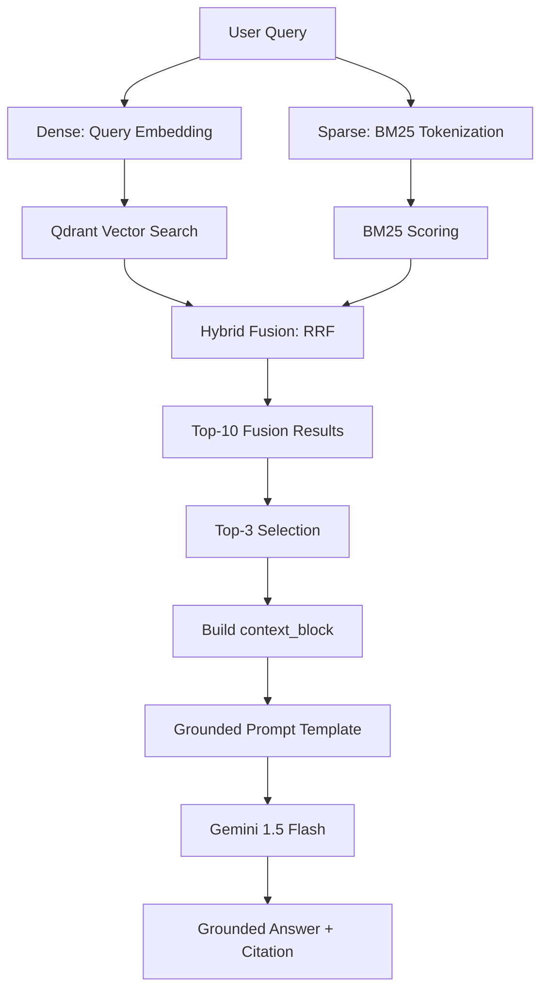

# Architecture — RAG Pipeline (Day 08 Lab)

## 1. Tổng quan kiến trúc

```
[Raw Docs]
    ↓
[index.py: Preprocess → Chunk → Embed → Store]
    ↓
[Qdrant Vector Database]
    ↓
[rag_answer.py: Query → Retrieve → Rerank → Generate]
    ↓
[Grounded Answer + Citation]
```

**Mô tả ngắn gọn:**
Hệ thống RAG hỗ trợ tra cứu các quy trình nội bộ (SLA, Refund, Access Control) cho nhân viên CS và IT. Hệ thống giải quyết vấn đề tìm kiếm thông tin phân tán trong nhiều file tài liệu khác nhau bằng cách cung cấp câu trả lời tổng hợp kèm trích dẫn nguồn cụ thể.

---

## 2. Indexing Pipeline (Sprint 1)

### Tài liệu được index
| File | Nguồn | Department | Số chunk |
|------|-------|-----------|---------|
| `policy_refund_v4.txt` | policy/refund-v4.pdf | CS | 9 |
| `sla_p1_2026.txt` | support/sla-p1-2026.pdf | IT | 2 |
| `access_control_sop.txt` | it/access-control-sop.md | IT Security | 5 |
| `it_helpdesk_faq.txt` | support/helpdesk-faq.md | IT | 7 |
| `hr_leave_policy.txt` | hr/leave-policy-2026.pdf | HR | 6 |

### Quyết định chunking
| Tham số | Giá trị | Lý do |
|---------|---------|-------|
| Chunk size | ~500 chars | Cân bằng giữa ngữ cảnh và độ chính xác |
| Overlap | 100 chars | Tránh mất ngữ cảnh ở biên các chunk |
| Chunking strategy | Paragraph-based (\n\n) | Giữ trọn vẹn các điều khoản hoặc câu hỏi/trả lời |
| Metadata fields | source, section, direct, access, etc. | Phục vụ trích dẫn và lọc dữ liệu |

### Embedding model
- **Model**: `Qwen/Qwen3-Embedding-0.6B` (Local)
- **Vector store**: Qdrant (Cloud/Local)
- **Similarity metric**: Cosine (với query_points / search)

---

## 3. Retrieval Pipeline (Sprint 2 + 3)

### Baseline (Sprint 2)
| Tham số | Giá trị |
|---------|---------|
| Strategy | Dense (embedding similarity) |
| Top-k search | 10 |
| Top-k select | 3 |
| Rerank | Không |

### Variant (Sprint 3)
| Tham số | Giá trị | Thay đổi so với baseline |
|---------|---------|------------------------|
| Strategy | Hybrid (Dense + BM25) | Thêm keyword search với RRF |
| Top-k search | 10 | Như cũ |
| Top-k select | 3 | Như cũ |
| Rerank | Không | Chưa sử dụng cross-encoder |
| Query transform | Không | Giữ nguyên query gốc |

**Lý do chọn variant này:**
Variant Hybrid được chọn vì hệ thống cần tra cứu các thuật ngữ kỹ thuật và mã lỗi (ví dụ: ERR-403, P1) - những thông tin mà Dense Retrieval đôi khi bỏ lỡ do xu hướng tập trung vào ý nghĩa ngữ nghĩa thay vì khớp từ khóa chính xác.

---

## 4. Generation (Sprint 2)

### Grounded Prompt Template
```
Answer only from the retrieved context below.
If the context is insufficient, say you do not know.
Cite the source field when possible.
Keep your answer short, clear, and factual.

Question: {query}

Context:
[1] {source} | {section} | score={score}
{chunk_text}

[2] ...

Answer:
```

### LLM Configuration
| Tham số | Giá trị |
|---------|---------|
| Model | `gemini-1.5-flash` |
| Temperature | 0 (ổn định kết quả) |
| Max tokens | 512 |

---

## 5. Failure Mode Checklist

> Dùng khi debug — kiểm tra lần lượt: index → retrieval → generation

| Failure Mode | Triệu chứng | Cách kiểm tra |
|-------------|-------------|---------------|
| Index lỗi | Retrieve về docs cũ / sai version | `inspect_metadata_coverage()` trong index.py |
| Chunking tệ | Chunk cắt giữa điều khoản | `list_chunks()` và đọc text preview |
| Retrieval lỗi | Không tìm được expected source | `score_context_recall()` trong eval.py |
| Generation lỗi | Answer không grounded / bịa | `score_faithfulness()` trong eval.py |
| Token overload | Context quá dài → lost in the middle | Kiểm tra độ dài context_block |

---

## 6. Diagram (tùy chọn)

> TODO: Vẽ sơ đồ pipeline nếu có thời gian. Có thể dùng Mermaid hoặc drawio.


