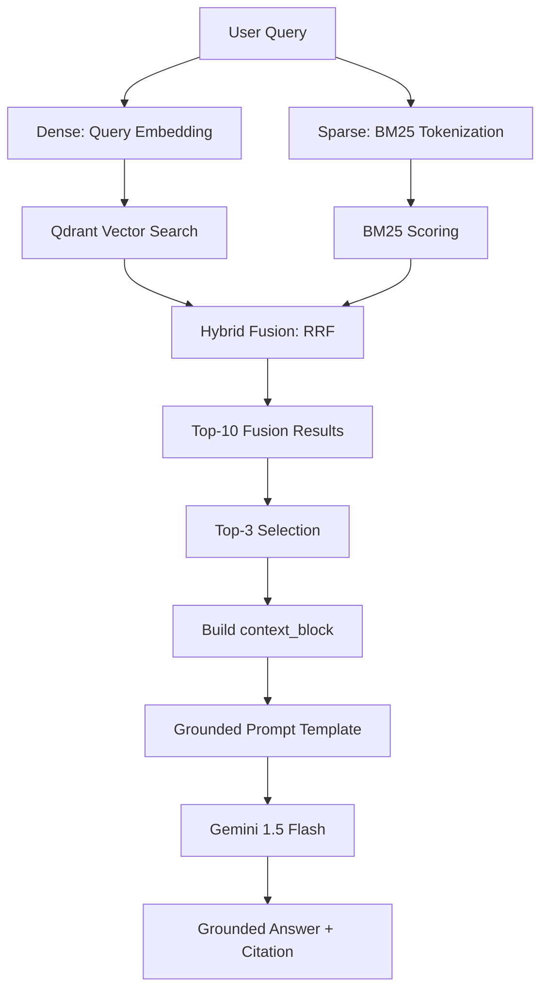

# Group Report — Lab Day 08: RAG Pipeline

**Nhóm:** 004
**Thành viên:** 
- **Bùi Trọng Anh**: Tech Lead & Documentation Owner (Sprints 1, 2, 4)
- **Nguyễn Bằng Anh**: Retrieval Owner (Sprints 1, 3)
- **Đỗ Thị Thùy Trang**: Eval Owner (Sprints 3, 4)

---

## 1. Tổng quan hệ thống (System Overview)

Dự án này xây dựng một hệ thống RAG (Retrieval-Augmented Generation) nhằm giải quyết nhu cầu tra cứu thông tin chính sách nội bộ một cách nhanh chóng và chính xác cho nhân viên CS (Customer Support) và IT Helpdesk. Hệ thống tập trung vào tính **Grounding** (trung thực) qua việc ép model trích dẫn nguồn cụ thể và tính **Recall** (độ bao phủ) qua chiến lược Hybrid Retrieval.

### Sơ đồ Pipeline
Hệ thống được thiết kế theo mô hình Funnel với khả năng mở rộng tốt:

---

## 2. Các quyết định kỹ thuật chủ chốt

### Chiến lược Chunking (Sprint 1)
Nhóm lựa chọn **Paragraph-based chunking** (`\n\n`) thay vì `token-based`. 
- **Lý do:** Các tài liệu quy trình (SOP) và FAQ có cấu trúc logic theo đoạn. Việc tách bừa bãi theo số lượng từ sẽ làm mất đi tính liên kết giữa câu hỏi và câu trả lời hoặc giữa các bước trong một điều khoản.
- **Tham số:** Size ~500 chars, Overlap 100 chars để duy trì mạch thông tin giữa các đoạn văn dài.

### Retrieval Strategy: Baseline vs Variant (Sprint 2 & 3)
- **Baseline (Dense):** Sử dụng `Qwen/Qwen3-Embedding-0.6B` để tìm kiếm sự tương đồng về ngữ nghĩa.
- **Variant (Hybrid):** Kết hợp kết quả từ Dense Retrieval và Sparse Retrieval (BM25) qua thuật toán **Reciprocal Rank Fusion (RRF)**.
- **Lý do nòng cốt:** Dense search thường bỏ sót các mã lỗi cụ thể hoặc mã Ticket (như ERR-403, P1). BM25 giúp đảm bảo các từ khóa quan trọng này không bị trôi đi, từ đó giúp LLM nhận được đúng chứng cứ cần thiết.

---

## 3. Kết quả đánh giá & So sánh (Sprint 4)

Chúng tôi đã chạy đánh giá trên 10 câu hỏi thử nghiệm với framework **LLM-as-Judge**. Kết quả so sánh giữa hai cấu hình:

| Metric | Baseline (Dense) | Variant (Hybrid) | Delta | Nhận xét |
|--------|------------------|------------------|-------|----------|
| **Faithfulness** | 4.70 | **5.00** | +0.30 | Hybrid giúp trích xuất chính xác context chứa từ khóa kỹ thuật, giảm ảo giác. |
| **Answer Relevance** | **3.40** | 3.30 | -0.10 | Việc gộp nhiều nguồn đôi khi làm loãng sự tập trung của model. |
| **Context Recall** | 5.00 | 5.00 | 0.00 | Cả hai đều bao phủ tốt các file tài liệu mục tiêu. |
| **Completeness** | 3.70 | **3.80** | +0.10 | Hybrid lấy được các đoạn văn chi tiết hơn nhờ khớp từ khóa. |

---

## 4. Kết luận & Quyết định chọn Variant

Dựa trên số liệu scorecard, nhóm quyết định chọn **Variant Hybrid (RRF)** làm giải pháp cuối cùng cho việc nộp bài grading. 

**Lý do chọn lựa:**
1. **Tính tin cậy cao nhất:** Điểm Faithfulness tuyệt đối (5.0) đảm bảo hệ thống không trả lời sai lệch các quy định nhạy cảm của công ty.
2. **Xử lý Alias/Keywords tốt:** Khả năng nhận diện tài liệu qua các từ khóa cũ (như phân tích ở câu q07) mang lại trải nghiệm người dùng tốt hơn khi họ không nhớ chính xác tiêu đề tài liệu hiện hành.
3. **Mở rộng dễ dàng:** Cấu trúc Hybrid cho phép chúng tôi dễ dàng tích hợp thêm các nguồn dữ liệu mới mà không cần quá lo lắng về việc fine-tune lại model embedding.

---

## 5. Metadata & Trích dẫn
Tất cả các chunk đều được gắn ít nhất 4 trường metadata: `source`, `section`, `department`, và `effective_date`. Điều này cho phép hệ thống tạo ra các trích dẫn có dạng: `[1] support/sla-p1-2026.pdf | Phần 2: Quy định ưu tiên`, giúp người dùng dễ dàng đối chiếu thông tin gốc.
