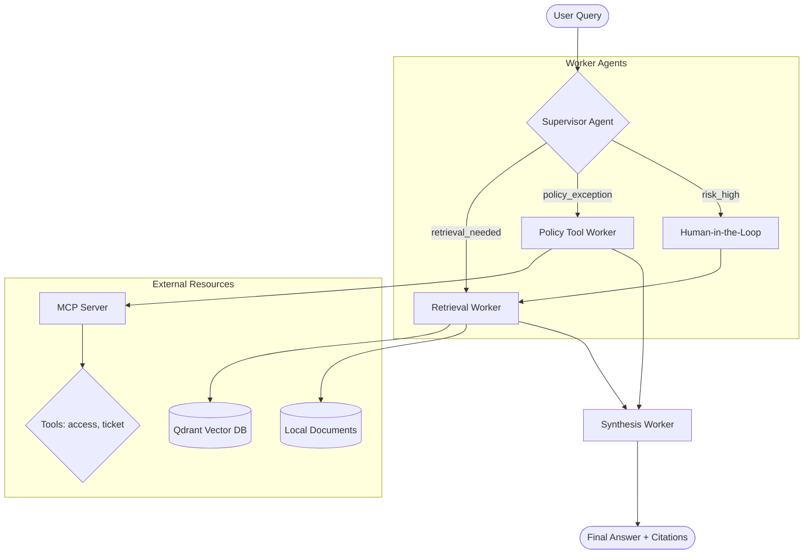

# System Architecture — Lab Day 09

## 1. Thành phần hệ thống (Component Diagram)

## 2. Shared State Management (AgentState)

Hệ thống sử dụng một `TypedDict` duy nhất để truyền dữ liệu qua các nodes trong LangGraph:

- `task`: Query gốc.
- `supervisor_route`: Quyết định điều hướng.
- `retrieved_chunks`: List các đoạn văn bản tìm được.
- `policy_result`: Phân tích chính sách từ worker.
- `mcp_tools_used`: Lịch sử các tool đã gọi qua MCP.
- `history`: Nhật ký các bước xử lý (Annotated với `operator.add`).

## 3. Worker Design

### Retrieval Worker
- **Logic**: Sử dụng Hybrid Search. Ưu tiên vector search với `all-MiniLM-L6-v2`. Nếu gặp lỗi môi trường (locking), tự động chuyển sang keyword-based search trên files vật lý.
- **Output**: Trả về 3-5 chunks có độ liên quan cao nhất kèm theo nguồn (source).

### Policy Tool Worker
- **Logic**: Node này chịu trách nhiệm cho các logic phức tạp. Nó gọi MCP tools như `check_access_permission` hoặc `get_ticket_info` dựa trên phân tích keywords trong query.
- **Output**: `policy_applies` (True/False) và danh sách các `exceptions_found`.

### Synthesis Worker
- **Logic**: Node cuối cùng chịu trách nhiệm tổng hợp. Sử dụng LLM (Gemini 2.0 Flash) với prompt khắt khe về việc trích dẫn nguồn.
- **Grounding**: Chỉ được phép trả lời dựa trên `retrieved_chunks` và `policy_result`.

## 4. MCP Integration

Hệ thống MCP đóng vai trò là "cánh tay nối dài" cho agent, cho phép truy cập vào các hệ thống bên ngoài mà không cần sửa đổi logic cốt lõi của Agent. Node `Policy Tool Worker` đóng vai trò là controller điều phối việc gọi MCP.

## 5. Runtime Snapshot (từ eval_report)

Số liệu tổng hợp từ `artifacts/eval_report.json` cho thấy kiến trúc đang vận hành như sau:

- Total traces: **157**
- Routing distribution:
    - `retrieval_worker`: **85/157 (54%)**
    - `policy_tool_worker`: **72/157 (45%)**
- Avg confidence: **0.589**
- Avg latency: **8495 ms**
- MCP usage rate: **34/157 (21%)**
- HITL rate: **9/157 (5%)**

Diễn giải kiến trúc từ các số liệu này:
- Supervisor đã phân phối tải gần cân bằng giữa 2 nhánh chính (retrieval/policy), thay vì dồn về một worker duy nhất.
- Nhánh policy có mức sử dụng MCP thực tế (21%), chứng minh integration không chỉ tồn tại trong code mà đã được kích hoạt trong runtime.
- Tỷ lệ HITL thấp (5%) cho thấy rule routing đủ ổn định cho đa số câu hỏi, chỉ escalates trong nhóm truy vấn rủi ro.

## 6. Source Coverage Priority

Top sources xuất hiện nhiều nhất trong trace:

1. `policy_refund_v4.txt` (92)
2. `access_control_sop.txt` (70)
3. `sla_p1_2026.txt` (57)
4. `it_helpdesk_faq.txt` (25)
5. `hr_leave_policy.txt` (9)

Insight: hệ thống đang ưu tiên mạnh domain Refund + Access Control, phù hợp với cách supervisor route theo keyword policy/access.

---
*Lưu tại: `docs/system_architecture.md`*
