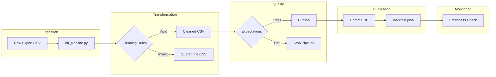

# Kiến trúc pipeline — Lab Day 10

**Nhóm:** Team AI Thuc Chien - Group Day 10  
**Cập nhật:** 2026-04-15

---

## 1. Sơ đồ luồng

- **Freshness**: Đo tại bước publish bằng cách so sánh `latest_exported_at` trong manifest với thời gian hiện tại.
- **Run ID**: Mỗi run được gán một `run_id` (timestamp hoặc custom) và được ghi vào log, manifest, và metadata của vector.
- **Quarantine**: Các record không đạt chuẩn (sai format ngày, doc_id lạ, version cũ) được đẩy ra `artifacts/quarantine/`.

---

## 2. Ranh giới trách nhiệm

| Thành phần | Input | Output | Owner nhóm |
|------------|-------|--------|--------------|
| Ingest | Raw CSV | Dict Rows | Bùi Trọng Anh |
| Transform | Dict Rows | Cleaned Rows | Nguyễn Bằng Anh |
| Quality | Cleaned Rows | Result/Halt | Nguyễn Bằng Anh |
| Embed | Cleaned Rows | Chroma Collection | Đỗ Thị Thùy Trang |
| Monitor | manifest.json | Status PASS/FAIL | Bùi Trọng Anh |

---

## 3. Idempotency & rerun

Pipeline sử dụng strategy **Upsert** dựa trên `chunk_id`. `chunk_id` được sinh ra bằng cách hash nội dung `chunk_text` kết hợp với `doc_id` và số thứ tự, đảm bảo tính ổn định.
- **Pruning**: Trước khi publish, pipeline sẽ xóa các ID cũ không còn xuất hiện trong bộ cleaned mới, tránh việc vector cũ (stale) làm ảnh hưởng đến kết quả retrieval. Rerun nhiều lần không làm phình tài nguyên.

---

## 4. Liên hệ Day 09

Pipeline này cung cấp corpus đã được làm sạch và chuẩn hóa cho Agent ở Day 09. Bằng cách đảm bảo `policy_refund_v4` luôn là 7 ngày (thay vì 14 ngày ở bản cũ), Agent sẽ không bị trả lời sai kiến thức.

---

## 5. Rủi ro đã biết

- **Lỗi Encoding**: Trên môi trường Windows, một số ký tự tiếng Việt có thể gây lỗi log console (đã được fix bằng cách dùng ký tự chuẩn).
- **Freshness SLA**: Dữ liệu mẫu thường cũ hơn 24h nên freshness check mặc định sẽ FAIL trên data lab.
